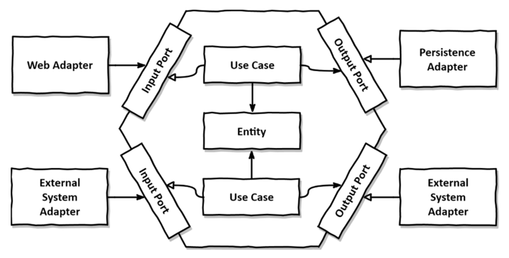

# 만들면서 배우는 클린 아키텍처

- URL : https://product.kyobobook.co.kr/detail/S000001766486

## chapter01. 계층형 아키텍처의 문제는 무엇일까?

### 계층형 아키텍처는 데이터베이스 주도 설계를 유도한다

1. 계층형 아키텍처의 의존성 방향은 웹 계층은 도메인 계층, 도메인 계층은 영속성 계층에 의존하므로 자연스레 DB 에 의존하게 된다.

   (웹 계층 → 도메인 계층 → 영속성 계층 → DB)
2. 개발자는 행동(behavior) 중심으로 모델링해야 하지만 layered architecture 의존성 방향에 따라 구현하기 때문에
   DB 구조를 먼저 생각하고 도메인 로직을 구현한다.
3. ORM 과 layered architecture 와 결합하면 비즈니스 규칙을 영속성 관점을 중점적으로 설계할 위험이 있다.
   또한 영속성 계층과 도메인 계층 사이에 강한 결합이 생긴다. (둘 중 하나만 변경하는 것이 어려워진다.)
4. 영속성 계층은 모든 것에 접근 가능하기 때문에 시간이 지나면서 점점 비대해진다.

### 테스트하기 어려워진다.

1. 영속성 컴포넌트에 의존성이 많이 쌓이면서 테스트의 복잡도를 높인다. 종속성이 많아지면 모킹(mocking) 작성에 대한 비용이 늘어난다.

### 유스케이스를 숨긴다.

1. 기능을 추가하거나 변경할 적절한 위치를 찾는 일이 빈번하기 때문에 아키텍처를 코드를 빠르게 탐색하는 데 도움이 돼야 한다.
2. 계층형 아키텍처는 도메인 로직이 여러 계층에 걸쳐 흩어지기 쉬워 기능 추가할 위치를 찾기 어려워진다.

### 동시 작업이 어려워진다.

1. 도메인 로직이 여러 계층에 흩어지면 로직의 응집도나 갖아지고 변경 지점이 늘어난다. 결국 동시 작업이 얼워진다.
2. 인원이 더 투입될 경우 인원 투입에 비해 병합 충돌이 발생할 위험이 높아 동시 작업이 늦어질 수 있다.
3. DB 주도 설계는 영속성 로직이 도메인 로직과 뒤섞여 각 측면을 개별적으로 작업하기 어렵다.

### 유지보수 가능한 SW 를 만드는데 어떻게 도움이 될까?

1. layered architecture 에 몇 가지 추가 규칙을 적용하면 유지보수하기 매우 쉽고 코드를 쉽게 변경, 추가할 수 있게 된다.

 

## chapter02. 의존성 역전하기

### 단일 책임 원칙(SRP)

1. SRP 실제 정의 : **컴포넌트를 변경하는 이유는 오직 하나 뿐**이어야 한다.(단일 변경 이유 원칙)
2. 변경할 이유가 한 가지라면 다른 이유로 SW 를 변경하더라도 이 컴포넌트에 대해 신경 쓸 필요가 없다.
3. 변경의 이유는 컴포넌트 간의 **의존성을 통해 쉽게 전파**된다.
4. 많은 코드는 SRP 를 위반하기 때문에 시간이 지날수록 변경하기 어렵고 변경 비용이 증가한다.

### 부수효과에 관한 이유

1. 코드의 한 영역 변경이 다른 영역에 부수효과를 일으킬 수 있다.
2. 잘못 구조화된 SW 를 변경하는데 더 많은 비용을 지불하도록 만든다.

### 의존성 역전 원칙(DIP)

1. 영속성 계층에 관한 도메인 계층의 의존성 떄문에 영속성 계층 변경시 잠재적으로 도메인 계층도 변경해야 한다.

   (영속성 코드가 바뀐다고 해서 도메인 코드까지 변경하는 것은 적절한 선택은 아니다.)
2. DIP : 코드상의 어떤 의존성이든 그 방향을 바꿀 수 있다.
    - 의존성 역전을 하면 영속성 코드가 도메인 코드에 의존하고, 도메인 코드를 변경할 이유의 갯수는 줄어든다. (전의 의존성이 줄어듦)

### 클린 아키텍처

1. **도메인 코드가 바깥으로 향하는 어떤 의존성도 없어야 함을 의미**한다.
    - 대신 DIP 의 도움으로 모든 의존성이 도메인 코드를 향하고 있다.
    - 계층 간의 모든 의존성이 안쪽으로 향해야 한다.
2. ORM 을 사용할 경우, 도메인 계층은 영속성 계층을 모르기 때문에 두 계층의 엔티티를 만들어야 한다.
    - 도메인 계층과 영속성 계층이 데이터를 주고 받을 때 두 엔티티를 서로 변환해야 한다.
    - 도메인 코드와 ORM 이 분리하면 기본 생성자와 코드 생성을 할 필요가 없다.

### 육각형 아키텍처 (헥사고날 아키텍처)

1. port-and-adapters 아키텍처라고도 부른다.
2. 육각형 외부로 향하는 의존성을 없고 모든 의존성을 코어를 향한다.
3. 육각형 바깥에는 애플리케이션과 상호작용하는 다양한 어댑터들이 있다.
4. 애플리케이션 코어와 어댑터들 간의 통신이 가능하려면 **애플리케이션 코어가 각각의 포트를 제공**해야 한다.
