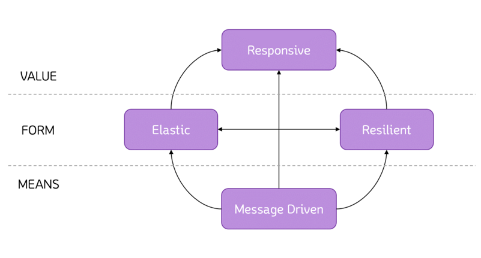
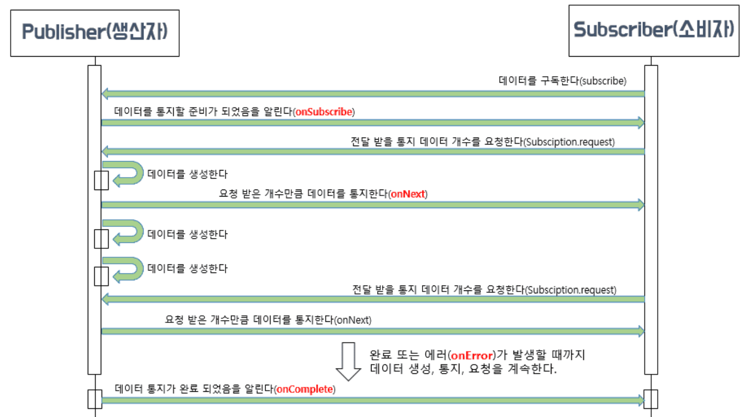
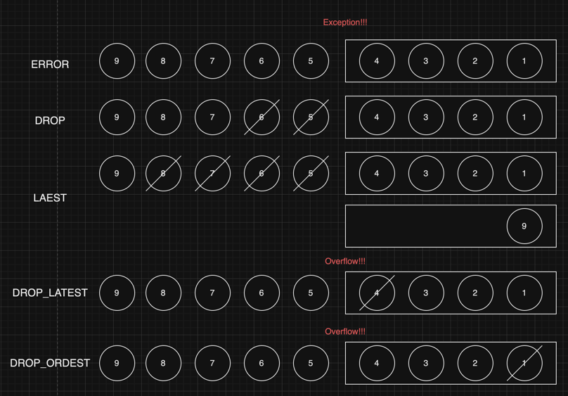

# 스프링으로 시작하는 리액티브 프로그래밍

- URL : https://product.kyobobook.co.kr/detail/S000201399476
- source code : https://github.com/bjpublic/Spring-Reactive

## chapter01. 리액티브 시스템과 리액티브 프로그래밍

### 리액티브 시스템

1. 리액티브 시스템
    - 사전적 의미 : 어떤 이벤트나 상황이 발생했을 때, 반응을 해서 그에 따라 적절하게 행동하는 것
    - 장점 : 클라이언트 요청에 <u>즉각적으로 응답함으로써 지연 시간을 최소화</u>한다.

### 리액티브 선언문 (설계 원칙)



> 빠른 응답성을 바탕으로 유지보수와 확장이 용이한 시스템 구축에 도움이 된다.

- MEANS : reactive system 주요 통신 수단으로 무엇을 사용할 것인지 표현
    - 비동기 메시지 기반의 통신을 통해 느슨한 결합, 격리성, 위치 투명성 보장
- FORM : 비동기 메시지 통신을 통해 어떠한 형태를 지니는 시스템으로 형성되는지에 관한 내용
    - 탄력성(elastic) : 시스템 작업량이 변화하더라도 일정한 응답을 유지한다.
    - 회복성(resilient) : 시스템 장애 발생 시 응답성을 유지하는 것을 의미
- VALUE : 회복성과 탄력성을 기반으로 즉각적 응답 가능한 시스템 구축이 가능하다.

### 리액티브 프로그래밍

- Non-blocking 방식의 통신
    - Blocking : 해당 스레드의 작업이 처리될 때까지 남아있는 작업들이 대기하는 방식 (스레드 차단)
    - Non-blocking : 해당 작업 처리를 대기하지 않고 남아있는 작업을 처리하는 방식

### 리액티브 프로그래밍 특징

1. declarative programming
    - 선언적 : 실행할 동작을 구체적으로 명시하지 않고 목표만 선언하는 방식
    - 명령형 : 실행할 동작을 구체적으로 명시하는 방식
2. data stream & the propagation of change
    - data stream : 데이터가 지속적으로 발생한다는 의미
    - the propagation of change : 지속적으로 데이터가 발생할 때마다 변화하는 이벤트를 보고,
      이 이벤트를 발생시키면서 데이터를 계속적으로 전달하는 것

### 리액티브 프로그래밍 코드 구성

1. publisher : 입력으로 들어오는 데이터를 제공하는 역할
2. subscriber : publisher 로부터 전달받은 데이터를 사용하는 역할
3. data source : publisher 의 입력으로 들어오는 데이터를 대표하는 용어 (reactive programming 에서는 data stream)
4. operator : publisher 와 subscriber 중간에서 가공 처리가 이루어지는 영역

<br>

## chapter02. 리액티브 스트림즈

### 리액티브 스트림즈

- 데이터 스트림을 non-blocking 이면서 비동기적인 방식으로 처리하기 위한 리액티브 라이브러리 표준 사양

### 리액티브 스트림즈 구성요소

| 컴포넌트         | 설명                                                                                                                       |
|--------------|--------------------------------------------------------------------------------------------------------------------------|
| Publisher    | 데이터 생성, 발생하는 역할                                                                                                          |
| Subscriber   | 구독한 publisher 로 부터 데이터를 전달받아 처리하는 역할                                                                                     |
| Subscription | Publisher 에 요청할 데이터 개수를 지정하고, 데이터 구독을 취소하는 역할                                                                            |
| Processor    | Publisher & Subscriber 의 기능을 모두 가지고 있다. 즉, Subscriber 로서 다른 Publisher 를 구독할 수 있고, Publisher 로서 다른 Subscriber 가 구독할 수 있다. |



### Publisher

```java
public interface Publisher<T> {
	public void subscribe(Subscriber<? super T> s);
}
```

- subscribe : 전달받은 Subscriber 를 등록하는 역할을 한다.
  (Pubsub 은 메시지 데이터 전송만 하면 되기 떄문에 loose coupled structure 라 볼 수 있다.)

### Subscriber

```java

public interface Subscriber<T> {
	public void onSubscribe(Subscription s);

	public void onNext(T t);

	public void onError(Throwable t);

	public void onComplete();
}
```

- onSubscribe : 구독 시작 시점에 어떤 처리를 하는 역할
- onNext : Publisher 가 데이터 통지를 위한 처리하는 역할
- onError : Publisher 가 데이터 통지를 위한 처리 과정에서 에러가 발생했을 때 해당 에러를 처리하는 역할
- onComplete : Publisher 가 데이터 통지를 완료했음을 알릴 때 호출되는 메서드

### Subscription

```java
public interface Subscription {
	public void request(long n);

	public void cancel();
}
```

- request : Publisher 에게 요청할 데이터 갯수
- cancel : 구독을 취소할 수 있음

### 동작 과정

1. Publisher 내부 에서 Subscriber onSubscribe() 메서드 호출 -> Subscriber 에게 Subscription 을 전달
2. Subscriber onSubscription() 메서드에서 전달받은 Publisher 에게 Subscription 객체를 통해 전달받을 데이터 갯수 요청
3. Publisher 는 Subscriber onNext() 를 통해 Subscriber 에게 전달
4. Publisher 의 발행할 데이터가 없으면 onComplete() 호출 -> Subscriber 에게 데이터 처리 종료를 알림

### Processor

```java
public interface Processor<T, R> extends Subscriber<T>, Publisher<T> {
}
```

- Publisher, Subscriber 를 모두 상속하고 있음
- Publisher & Subscriber 의 기능을 모두 가지고 있음

### 리액티브 스트림즈 관련 용어 정의

- Signal : Publisher & Subscriber 가넹 주고 받는 상호 작용
    - onSubscriber(), onNest(), onCompmlete(), onError(), request(), cancel()
- Demand : Publisher 가 Subscriber 에게 아직 전달하지 않은 요청 데이터
- Emit : 데이터를 내보내는 과정
    - 데이터를 전달하기 위한 onNext Signal -> 데이터를 emit 한다.
- upstream, downstream : 코드 라인 기준 상위, 하위에 존재하는 스트림
- sequence : Publisher 가 emit 하는 데이터의 연속적인 흐름을 정의해 놓은 자체
- Operator : 연산자 (reactive programming 핵심)
- Source : '최초의' 의미 (Original 용어도 사용)

## chapter03. Blocking I/O 와 Non-Blocking I/O

### Blocking I/O

- DB I/O : database 데이터 조회, 추가 작업
- Network I/O : web application 간의 네트워크 작업

- Blocking I/O : 하나의 스레드가 I/O 에 의해서 차단되어 대기하는 것
    - multi-threading
        - 정의 : Blocking I/O 의 문제점을 보완하기 위해 추가 스레드를 할당하여 차단된 시간을 효율적으로 사용하기 위한 방법
        - 문제점
            - context switching 으로 인한 스레드 전환 비용이 발생 (TCB 저장, reload 시간 동안 CPU 가 대기하는 오버 헤드가 발생한다.)
            - 과도한 메모리 사용으로 인한 오버헤드 : servlet 기반 WAS 는 thread per request 형태로 요청이 많아 메모리 사용량이 증가할 수 있다.
            - thread pool 에서 발생하는 응답 지연 : thread pool 의 유휴 스레드가 없을 경우 응답 지연이 발생한다.
- Non-Blocking I/O
    - 정의 : worker thread 의 종료 여부 관계없이 요청한 스레드는 차단되지 않는 방식
    - 장점
        - 하나의 스레드로 많은 수의 요청을 처리할 수 있다. (Blocking I/O 방식보다 더 적은 수의 스레드 사용)
        - I/O bound 인 경우에 성능에 이점이 있다.
    - 단점 : CPU bound 인 경우, 성능에 악영향을 준다.

### spring framework 에서의 Blocking I/O 와 Non-Blocking I/O

- Spring MVC
    - Blocking I/O 를 처리하기 때문에 대용량 처리가 버거울 수 있는 시대가 되었다.
    - 대표적인 Bean : RestTemplate
- Spring Webflux
    - Netty 기반 비동기 Non-Blocking I/O 기반의 서버이다.
    - 적은 수의 스레드로 많은 요청을 처리하여 CPU 와 메모리를 효율적으로 사용할 수 있다.
    - 대표적인 Bean : WebClient

### Non-Blocking I/O 방식의 통신이 적합한 시스템

- 고려사항 : 학습 난이도 + reactive programming 개발 인력 확보가 쉬운가
- 서비스 종료
    - 대량의 트래픽이 발생하는 시스템 : 상대적으로 저비용으로 고수준의 성능을 이끌어 낼 수 있는 선택이 될 수 있다.
    - MSA : 특정 서버의 응답 지연이 발생하면 전체 서비스에 영향을 미칠 수 있기 때문에 비동기를 지향한다.
    - 스트리밍 또는 실시간 시스템 : 끊임없이 들어오는 데이터 스트림의 효율적 처리가 가능

## chapter04. 리액티브 프로그래밍을 위한 사전 지식

1. Functional Interface
2. 람다 표현식
3. 메서드 레퍼런스
4. 함수 디스크립터
    - Functional interface 가 어떤 파라미터를 가지고 어떤 값을 리턴하는지 설명해주는 역할

| Functional Interface | Function Descriptor |
|:--------------------:|:-------------------:|
|      Predicate       |    T -> boolean     |
|       Consumer       |      T -> void      |
|    Function<T,R>     |       T -> R        |
|       Supplier       |      ( ) -> T       |
|  BiPredicate<L, R>   |  (L, R) -> boolean  |
|   BiConsumer<L, R>   |   (T, U) -> void    |
|  BiFunction<T,U,R>   |     (T, U) -> R     |
|       Runnable       |     () -> void      |

## chapter05. Reactor 개요

### Reactor 란?

- Reactor 의 publisher 과 subscriber 은 functional programming API 를 통해 작성됨
- Flux[N] : N 개의 데이터를 emit 한다는 의미
- Mono[0|1] : 0 or 1 개의 데이터만 emit 한다는 의미
- well-suited for MSA : non-blocking 으로 처리량이 높기 때문
- Backpressure-ready network : publisher 에서 전달한 데이터의 과부하를 제어하는 기능

### Hello Reactor 로 보는 Reactor 의 구성요소

```java
import lombok.extern.slf4j.Slf4j;
import reactor.core.publisher.Flux;

@Slf4j
public class Example5_1 {
	public static void main(String[] args) {
		Flux<String> sequence = Flux.just("Hello", "Reactor"); // data source : Publisher 가 최초로 제공하는 가공되지 않은 데이터
		sequence.map(data -> data.toLowerCase()) // map() Operator 메서드 : 데이터를 가공하는 역할
			.subscribe(data -> System.out.println(data));
	}
}
```

## chapter06. 마블다이어그램

### 마블다이어그램(Marble Diagram) 이란?

- 구슬 모양으로 구성된 도표(다이어그램)
- 리액터의 Operator 의 이해와 흐름을 이해하는데 중요한 역할을 한다.


- timeline : 시간 순으로 데이터가 emit (left -> right)
    - onComplete() signal : 데이터 emit 이 정상적으로 데이터 처리가 종료됨을 의미
    - onError() signal : 데이터 emit 과정에서 에러가 발생해 데이터 처리가 종료를 의미
- source : operator 연산 수행 이전 데이터 값
- output : operator 연산 수행 이후 데이터 값

### 마블 다이어그램으로 Reactor 의 Publisher 이해하기

- Mono : 0개 또는 1개의 데이터를 emit 하는 Publisher (RxJava : MayBe)
    1. `just()` operator : 한 개 이상의 데이터는 emit 하기 위한 Operator. onNext signal 전송
        - HTTP request/response 응답에 사용하기 아주 적합한 publisher 타입
    2. `empty()` operator
        - 내부적으로 emit 할 데이터가 없는 것으로 간주하여 onComplete signal 전송
        - 작업이 끝났음을 알리고 이에 따른 후처리를 하고 싶을 때 사용할 수 있음.
    3. `justOrEmpty()`
        - just() + null 허용 (null 전달 시 내부적으로 empty() operator 호출)
    4. `concatWith()`
        - Publisher 를 연결해서 새로운 Publisher 의 데이터 소스를 만들어주는 operator
        - 두 개의 데이터 소스만 연결

- Flux : 여러 건의 데이터를 emit 할 수 있는 Publisher type
    1. `just()` operator :  한 개 이상의 데이터는 emit 하기 위한 Operator. onNext signal 전송
    2. `fromArray()` operator : 배열 데이터를 처리하기 위한 operator
    3. `concat()`

    - Publisher 를 연결해서 새로운 Publisher 의 데이터 소스를 만들어주는 operator
    - 두 개이상의 데이터 소스 연결 가능

<br>

## chapter07.Cold sequence 와 Hot Sequence

### Cold 와 Hot 의 의미

- Hot : 서버나 시스템을 다시 가동할 필요가 없고, 인터넷에 다시 연결할 필요 없이 바로 사용 가능하다는 의미 (e.g. Hot Swap, Hot Deploy)
- Cold : 처음부터 새로 시작해야 하고, 새로 시작하기 때문에 같은 작업이 반복됨. (e.g. Cold wallet)

### Cold sequence

- Subscriber 가 구독할 때마다 데이터 흐름이 처음부터 다시 시작되는 Sequence
- 구독 시점이 달라도 구독을 할 때마다 Publisher 가 데이터를 emit 하는 과정을 처음부터 다시 시작한다.
- 예시. Flux.fromIterable

### Hot sequence

- 구독이 발생한 시점 이전에 Publisher 로부터 emit 된 데이터는 Subscriber 가 전달받지 못하고 구독이 발생한 시점 이후에 emit 된 데이터만 전달 받을 수 있다.
- e.g. Flux<T>.share() : 여러 Subscriber 가 하나의 원본 Flux 를 공유한다는 의미
- e.g. Mono<T>.cache() : Cold Sequence 로 동작하는 Mono 를 Hot Sequence 로 변경해 주고 데이터를 캐시한 뒤, 구독이 발생할 때마다 캐시된 데이터를 전달한다.

<br>

## Backpressure

### Backpressure 란?

- Backpressure
    - 배관으로 흡수되는 가스나 액체 등의 흐름을 제어하기 위해 역으로 가해지는 압력을 의미
    - Publisher 가 끊임없이 emit 하는 무수히 많은 데이터를 적절하게 제어하여 데이터 처리에 과부하가 걸리지 않도록 제어하는 것
    - Publisher 가 끊임없이 emit 하는 경우 오버플로가 발생해 최악의 경우 시스템이 다운될 수 있다.

### Reactor 에서의 Backpressure 처리 방식

1. 데이터 갯수 제어
    - request() : 적절한 데이터 갯수를 요청하는 방식
        - hookOnSubscribe() : onSubscribe() 를 대신해 구독 시점에 request() 를 호출해 최초 데이터 요청 갯수를 제어하는 역할
        - hookOnNext() : onNext() 대신해 Publisher 가 emit 한 데이터를 전달받아 처리한 후에 publisher 에게 또 다시 데이터를 요청하는 역할
        - doOnRequest() : Subscriber 가 요청한 데이터 갯수를 확인하는 operator
        - publishOn() : 별도의 스레드가 하나 더 실행된다고 생각하기
2. Backpressure 전략 사용
    - 전략 종류
        - IGNORE : Backpressure 미적용
        - ERROR : Downstream 으로 전달할 데이터가 버퍼에 가득 찰 경우, Exception 발생 (IllegalException)T
        - DROP : Downstream 으로 전달할 데이터가 버퍼에 가득 찰 경우, 먼저 emit 된 데이터부터 Drop 시키는 전략
        - LATEST : Downstream 으로 전달할 데이터가 버퍼에 가득 찰 경우, 버퍼 밖에 대기하는 가장 최근에(나중에) emit 된 데이터부터 버퍼를 채우는 전략
        - BUFFER : Downstream 으로 전달할 데이터가 버퍼에 가득 찰 경우, 버퍼 안에 있는 데이터부터 Drop 시키는 전략



## chapter09.Sinks

### Sink 란?

1. sink
    - Reactor ver >= 3.4.0 부터 지원(Processor API Reactor 3.5.0 부터는 완전히 제거될 예정)
    - React API 문서 내용 : Sink 는 Reactive Streams 의 **Signal 을 프로그래밍 방식으로 push 할 수 있는 구조**이며 Flux, Mono 의미 체계를 가진다.
    - Flux, Mono 는 기본적으로 onNext 와 같은 Signal 을 내부적으로 전송한다.
        - 기존 signal 을 전송하는 방식 : create(), operate()
        - Single thread 를 기반으로 Signal 을 전송한다.
    - Sink 를 사용하면 **코드를 통해 명시적으로 Signal 을 전송**할 수 있다.
2. Sink 장점
    - thead safety 를 보장받을 수 있다.
        - thread safety : 공유 자원에 동시 접근할 경우 프로그램 실행에 문제가 없음(e.g. Dead Lock)
        - thread 의 동시 접근을 감지하고 동시 접근하는 스레드 중 하나가 빠르게 실패함으로써 스레드 안전성을 보장한다.

### Sinks 의 종류 및 특징

1. Sinks.One
    - 한 건의 데이터를 프로그래밍 방식으로 emit 하는 기능을 사용하고 싶다는 의미
    - 처음 emit 된 데이터는 정상적으로 emit 되지만 나머지 데이터는 drop 된다.
    - 에러가 발생했을 때 재시도를 하지 않고 즉시 실패 처리를 한다.
2. Sinks.Many
    - 여러 건의 데이터를 여러 가지 방식으로 전송하는 기능을 정의해 둔 기능 명세
    - ManySpec interface 제공 (e.g. UnicastSpec, MulticastSpec, MulticastReplaySpec)
        - UnitcastSpec : 하나의 Subscriber 에게만 데이터를 emit
        - MulticastSpec : 하나 이상의 Subscriber 에게 데이터를 emit
        - MulticastReplaySpec : emit 된 데이터 중에서 특정 시점으로 되돌린 데이터부터 emit
            - replay() : emit 된 데이터를 다시 replay 해서 구독 전에 이미 emit 된 데이터라도 Subscriber 가 전달받을 수 있게 하는 메서드
            - all() : emit 된 데이터부터 모든 데이터들이 Subscriber 에게 전달
            - limit() : emit 된 데이터 중에서 파라미터로 입력한 갯수만큼 가장 나중에 emit 된 데이터부터 Subscriber 에게 전달
3. FAIL_FAST
    - EmitFailureHandler interface 의 구현체
    - EmitFailureHandler : emit 도중 발생한 에러에 대해 빠르게 실패 처리를 하는 Handler

<br>

## chapter10. Scheduler

### 스레드 개념 이해

1. Reactor Scheduler : Reactor Sequence 에서 사용되는 스레드를 관리해주는 관리자
2. 스레드(thread)

- 물리적 스레드
    - 코어 : CPU 명령어를 처리하는 반도체 유닛
    - 물리적인 스레드는 병렬성(parallelism) 과 관련
- 논리적 스레드
    - S/W 으로 생성된 스레드
    - 프로세스 내에서 실행되는 세부 작업의 단위
    - 논리적인 스레드는 동시성(concurrency) 와 관련

### Scheduler

- OS level Scheduler : 프로세스의 라이프 사이클을 관리해주는 관리자 역할
- Reactor Scheduler : 비동기 프로그래밍을 위한 스레드 관리 역할 (어떤 스레드에서 무엇을 처리할지 제어)

### Scheduler Operator

1. subscribeOn() : 구독이 발생한 직후 실행된 스레드를 지정하는 operator
    - 원본 Publisher 의 동작을 수행하기 위한 스레드로 볼 수 있음(sub 발생 시 데이터가 최초로 emit 되기 떄문)
2. publishOn()
    - Downstream 으로 Signal 을 전송하는 논리적인 스레드를 제어하는 역할을 하는 operator
    - publishOn() 을 기준으로 Downstream 의 실행 스레드를 변경한다.
3. parallel()
    - 병렬성을 가지는 물리적인 스레드에 해당하는 operator
    - Round Robin 방식으로 CPU 코어 갯수만큼의 스레드를 병렬로 실행한다.
    - 4코어 8 스레드의 CPU 일 경우 8개의 스레드를 병렬로 실행한다.
    - runOn() : 병렬 작업을 수행할 스레드의 할당을 담당하는 operator

### publishOn() 과 subscribeOn() 의 동작 이해

- subscribeOn(), publishOn() 메서드 시점을 기준으로 downstream 에서 사용하는 스레드가 변경된다.
- subscribeOn()은 구독 직후에 실행될 쓰레드를 지정하고, publishOn()을 만나기 전까지 쓰레드를 변경하지 않는다.

### Scheduler 의 종류

1. Schedulers.immediate() : 별도의 스레드를 추가적으로 생성하지 않고 현재 스레드에서 작업을 처리하고자 할 때 사용
2. Schedulers.single() : 스레드 하나만 새엉해서 Scheduler 가 제거되기 전까지 재사용하는 방식
3. Schedulers.newSingle() : 호출할 때마다 매번 새로운 스레드 하나를 생성한다.
    - demon thread : 보조 스레드이며, 주 스레드가 종료되면 자동으로 종료되는 특성이 있다.
4. Schedulers.boundedElastic()
    - ExecutorService 기반의 thread pool 을 생성한 후, 그 안에 정해진 수만큼 스레드를 사용하여 작업 처리
    - Blocking I/O 작업을 효과적으로 처리하기 위한 방식
        - HTTP 와 같은 Blocking I/O 작업을 통해 전달받는 데이터를 데이터 소스로 사용하는 경우가 많음
    - 실행 시간이 긴 Blocking I/O 작업이 포함된 경우, 다른 Non-Blocking 처리에 영향을 주지 않도록 전용 스레드를 할당해서 Blocking I/O 를 처리하여 시간의 안정성 제공
5. Schedulers.parallel()
    - Non-Blocking I/O 에 최적화되어 있는 Scheduler
    - CPU 코어 수만큼의 스레드를 생성한다.
6. Schedulers.fromExecutorService()
    - 기존에 이미 사용하고 있는 ExecutorService 가 있다면 ExecutorService 로 부터 Scheduler 를 생성하는 방식
    - Reactor 에서는 권장하지 않는 방식
7. Schedulers.newXXX()
    - 새로운 Scheduler 인스턴스를 생성한다.
    - 스레드 이름, 생성 가능 디ㅗㄹ트 스레드 수, 스레드 유휴 시간, 데몬 스레드 동작 여부 등을 직접 지정한 custom thread pool 을 새로 생성할 수 있음

<br>

## chapter11. Context

### context 란?

1. Context : 어떠한 상황에서 그 상황을 처리하기 위해 필요한 정보
2. Reactor API Context
    - Operator 와 같은 Reactor 구성요소 간에 전파되는 key/value 형태의 저장소
    - 전파 : downstream -> upstream 으로 Context 가 전파되어 Operator 체인상의 각 Operator 가 해당 Context 정보를 동일하게 이용한다
    - 구독(subscribe) 이 발생할 때마다 해당 구독과 연결된 하나의 Context 가 생긴다.
3. 컨텍스트 데이터 쓰기
    - contextWrite()
        - function descriptor : Context -> Context
        - context.put(key, value) : key 를 기준으로 value 를 저장할 수 있는 역할
3. 컨텍스트 데이터 읽기
    1. context 에서 데이터를 읽는 방식
        - 원본 데이터 소스 레벨에서 읽는 방식
        - Operator 체인 중간에 읽는 방식
    2. deferContextual() : 원본 데이터 소스 레벨에서 context 정보를 읽는 방식
        - function descriptor : ContextView -> Mono 하위 클래스
        - contextView.get(key) : key 값을 기준으로 context 의 값을 조회한다.
    3. transformDeferContextual() : Operator chain 중간에서 데이터를 읽는 방식
        - Reactor 에서는 Operator 체인상의 서로 다른 스레드들의 Context 의 저장된 데이터에 손쉽게 접근할 수 있다.

### 자주 사용되는 Context 관련 API

1. Context API
    - ContextView put(key, value)
    - ContextView of(key1, value1, key2, value) : K/V 형태로 context 에 여러 개 값을 쓴다.
    - ContextView putAll(ContextView) : 현재 Context 와 파라미터로 입력된 ContextView 를 머지한다.
    - Context delete(key)
2. Context View API

- ContextView get(key)
- Optional<T> getOrEmpty(key)
- boolean hasKey(key)
- boolean isEmpty(key)
- size(key)

3. 핵심!!!
    - Context 데이터를 쓰기 위해서는 Context API 를 사용해야 한다.
    - Context 데이터를 읽기 위해서는 ContextView API 를 사용해야 한다.

### Context 의 특징

1. 구독이 발생할 때마다 해당하는 하나의 Context 가 하나의 구독에 연결된다.
    - Context 는 Operator chain 의 <u>아래에서 위로 전파된다.</u>
    - 동일한 키에 대한 값을 중복 저장하면 <u>Operator chain 가장 위쪽에 위치한 contextWrite() 저장 값으로 덮어쓴다.</u>
2. Operator 는 체인상의 아래에서 위로 전파된다.
    - 일반적으로 모든 Operator 에 Context 에 저장된 데이터를 읽을 있도록 contextWrite() 을 Operator chain 맨 마지막에 두자.
    - Inner Sequence
        - Inner Sequence 내부에서는 외부 Context 에 저장된 데이터를 읽을 수 있다.
        - Inner Sequence 외부에서는 Inner Sequence 내부 Context 에 저장된 데이터를 읽을 수 없다.
3. Context 는 인증 정보(e.g. 인증 토큰) 같은 직교성(독립성) 을 가지는 정보를 전송하는 데 적합하다.

<br>

## chapter12. Debugging

### Reactor 에서 디버깅 방법

1. Debug Mode 를 사용한 디버깅
    1. Hooks.onOperatorDebug() : Reactor 에서 디버그 모드 활성화
    2. 처음부터 디버그 모드를 활성화하는 것을 권장하지 않는다.
    3. 동작 과정에서 바라보는 한계
        1. application 내의 모든 Operator 의 stacktrace 를 캡처하낟.
        2. 에러 발생시 캡처한 정보를 기반으로 에러가 발생한 Assembly 의 stacktrace 를 원본 stacktrace 에 끼워 넣는다.
            - Assembly : Operator 에서 리턴하는 새로운 Mono, Flux 가 선언된 시점
            - Traceback : 에러가 발생한 Operator 의 stacktrace 를 캡처한 Assembly 정보
    4. **프로덕션 환경에서의 디버깅 설정**
        - build.gradle 에 `compile 'io.projectreactor:reactor-tool'`를 추가하여 ReactorDebugAgent 활성화
        - <u>ReactorDebugAgent 가 classpath 에 존재</u> + <u>spring.debug-agent.enable=true</u> 라면 app 시작 시,
          reactorDebugAgent.init() 호출 및 활성화됨.
2. checkpoint() Operator 를 사용한 디버깅
    1. debug mode 동작 차이 : 특정 Operator chain 내의 stacktrace 캡처
    2. 출력 방식
        1. traceback 을 출력하는 방법
            - `checkpoint()` : 실제 에러가 발생한 assembly 지점 또는 에러가 전파된 지점의 assembly 의 traceback 추가
        2. traceback 출력 없이 식별자를 포함한 description 을 출력해서 에러 발생 지점을 예상하는 방법
            - `checkpoint(description)` : traceback 을 생략하고 desription 을 통해 에러 발생 지점 예상
        3. traceback & description 을 모두 출력하는 방법
            - `checkpoint(description, forceStackTrace)`
3. log() operator 사용
    - onSubscribe(), request(), onNext(), cancel() 와 같은 Signal 출력
    - `log(String category, Log log)` : 로그 구분을 위한 카테고리 추가 방법 (e.g. .log("Fruit,Substring", Level.FINE))
        - Level.FINE : Java 에서 지원하는 로그 레벨(Slf4j 에서는 debug 에 해당)

### intellij 에서 reactor sequence 디버깅 지원

- settings> Languages & Frameworks > Reactive Streams
    - [check] Enable Reactor Debug mode
    - [check] Hooks.onOperatorDebug() : 디버그 모드 실행 시 동작

<br>

## chapter13.Testing

### StepVerifier 를 사용한 테스팅

1. 일반적인 방식 : Flux, Mono 를 Reactor Sequence 로 정의한 후, 구독 시점에 해당 Operator chain 이 시나리오대로 동작하는지 테스트
    - e.g. <u>Reactor Sequence 에서 다음에 발생할 Signal 이 무엇인지</u>, <u>기대하던 데이터들이 emit 되었는지</u>, <u>특정 시간 동안 emit 데이터가 있는지</u>
      등을 단계적으로 테스트 한다.
2. Signal 이벤트 테스트 : Reactor Sequence 에서 발생하는 Signal event 를 테스트하는 것
    - expectXXXX() 메서드
        1. expectSubscription() : 구독이 이루어짐을 기대한다.
        2. expectNext(T t) : onNext Signal 을 통해 전다로디는 값이 파라미터로 전달된 값과 같음을 기대한다.
        3. expectComplete() : onComplete Signal 이 전송되기를 기대한다.
        4. expectError() : onError Signal 이 전송되기를 기대한다.
        5. expectNextCount(long count) : 구독 시점 또는 이전 expectNext() 를 통해 기댓값이 평가된 데이터 이후부터 emit 된 수를 기대한다.
        6. expectNoEvent(Duration duration) : 주어진 시간 동안 Signal 이벤트가 발생하지 않았음을 기대한다.
        7. expectAccessibleContext() : 구독 시점 이후에 Context 가 전파되었음을 기대한다.
        8. expectNextSequence(Iterable <? extends T> iterable) : emit 된 데이터들이 파라미터로 전달된 Iterable 의 요소와 매치됨을 기대한다.
    - verifyXXXX() 메서드
        1. verify() : 검증을 트리거한다.
        2. verifyComplete() : 검증을 트리거하고, onComplete Signal 을 기대한다.
        3. verifyError() : 검증을 트리거하고, onError Signal 을 기대한다.
        4. verifyTimeout(Duration duration) : 검증을 트리거하고, 주어진 시간이 초과되어도 Publisher 가 종료되지 않음을 기대한다.

## chapter14.Operators

### Sequence 생성을 위한 Operator

1. justOrEmpty
    - just() 의 확장 함수
    - emit 할 데이터가 null 일 경우 NPE 를 발생하지 않고 onComplete Signal 을 전송한다.
2. fromIterable
    - Iterable 에 포함된 데이터를 emit 하는 Flux 를 생성합니다.
3. fromStream
    - Stream 에 포함된 데이터를 emit 하는 Flux 를 생성한다.
    - Stream 특성상 Stream 은 재사용할 수 없으며, cancel, error, complete 시에 자동으로 닫히게 된다.
4. range
    - n 부터 1씩 증가한 연속된 수를 m개 emit 하는 Flux 를 생성한다.
    - 명령형 언어를 for 문처럼 특정 횟수만큼 어떤 작업을 처리하고자 할 경우에 주로 사용
5. defer
    - Operator 를 선언한 시점에 데이터를 emit 하는 것이 아니라 구독하는 시점에 데이터를 emit 하는 Flux(or Mono) 를 생성한다.
    - 데이터 emit 을 지연시키기 때문에 꼭 필요한 시점에 데이터를 emit 하여 불필요한 프로세스를 줄일 수 있다.
6. using
    - 파라미터로 전달받은 resource 를 emit 하는 Flux 를 생성한다.
7. generate
    - 프로그래밍 방식으로 Signal event 를 발생시키며, 특히 동기적으로 데이터를 하나씩 순차적으로 emit 하고자 할 경우 사용된다.
8. create
    - generate() : 데이터를 동기적으로 한 번에 한 건씩 emit 한다.
    - create() : 한 번에 여러 건의 데이터를 비동기적으로 emit 한다.

### Sequence 필터링 Operator

1. filter
    - Upstream 에서 emit 된 데이터 중에서 조건에 일치하는 데이터만 Downstream 으로 emit 한다.
2. skip
    - Upstream 에서 emit 된 데이터 중에서 파라미터로 입력받은 숫자만큼 건너뛴 후, 나머지 데이터를 Downstream 으로 emit 한다.
3. take
    - Upstream 에서 emit 된 데이터 중에서 파라미터로 입력받은 숫자만큼만 Downstream 으로 emit 한다.
4. next
    - Upstream 에서 emit 된 데이터 중에서 첫 번째 데이터만 Downstream 으로 emit 한다.

### Sequence 변환 Operator

1. map
    - Upstream 에서 emit 된 데이터를 mapper Function 을 사용하여 변환한 후, Downstream 으로 emit 한다.
2. flatMap
    - Upstream 에서 emit 된 데이터 한 건이 Inner Sequence 에서 여러 건의 데이터로 변환된다.
    - Inner Sequence 에서 평탄화 작업을 거치면서 하나의 Sequence 로 병합되어 Downstream 으로 emit 한다.
3. concat
    - 파라미터로 입력된 Publisher 의 Sequence 를 연결해서 데이터를 순차적으로 emit 한다.
4. merge
    - 파라미터로 입력되는 Publisher 의 sequence 에서 emit 된 데이터를 인터리빙 방식으로 병합한다.
    - 인터리브 : 교차로 배치하다.
    - 두 개의 sequence 에서 emit 되는 데이터가 서로 교차되는 방식으로 merge 된다.
5. zip
    - 파라미터로 입력되는 Publisher Sequence 에서 emit 된 데이터를 결합하는데, 각 Publisher 가 데이터를 하나씩 emit 할 때까지 기다렸다가 결합힌다.
6. and
    - Mono 의 Complete Signal 과 파라미터로 입력된 Publisher 의 Complete Signal 을 결합하여 새로운 Mono<Void> 를 반환한다.
    - Mono 와 파라미터로 입력된 Publisher 의 Sequence 가 모두 종료되었음을 Subscriber 에게 알릴 수 있다.
7. collectList
    - Flux 에서 emit 된 데이터를 모아서 List 로 변환한 후, 변환된 List 를 emit 하는 Mono 를 반환한다.
8. collectMap
    - Flux 에서 emit 된 데이터를 기반으로 key, value 를 생성하여 Map 의 Element 로 추가한 후, 최종적으로 Map 을 emit 하는 Mono 를 반환한다.

### Sequence 의 내부 동작을 확인을 위한 Operator

### 에러 처리르 위한 Operator

### sequence 의 동작 시간 측정을 위한 Operator

### Flux Seqence 분할을 위한 Operator

### 다수 Subscriber 에게 Flux 를 멀티캐스팅(Multicasting) 하기 위한 Operator

<br>

## chapter15. Spring WebFlux 개요

### Spring Webflux 탄생 배경

- Spring MVC 방식으로 대용량의 요청을 작은 수의 스레드로 안정적으로 처리할 수 없어 Non-Blocking I/O 방식의 Spring Webflux 가 탄생

### Spring Webflux 의 기술 스택

1. Spring MVC 와의 차이
    1. 서버
        - Spring MVC : Servlet 기반이며 tomcat 과 같은 servlet container 에서 blocking i/o 방식으로 동작한다.
        - Spring Webflux : Non-Blocking 방식으로 동작하며 Netty 드으이 서버 엔진에서 동작한다.
    2. 서버 API
        - Spring MVC : servlet 기반 API 를 사용
        - Spring Webflux : 기본 서버 엔진이 netty 지만 Jetty, Undertow 와 같은 서버 엔진에서 지원하는 reactive streams adapter 를 통해
          리액티브 스트림즈를 지원한다.
    3. 보안
        - Spring MVC : Spring Security 가 서블릿 컨테이너와 통합
        - Spring Webflux : WebFilter 를 이용해 Spring Security 를 Spring WebFlux 에서 사용한다.
    4. 데이터 엑세스
        - Spring MVC : JDBC, JPA, MongoDB 와 같은 데이터 엑세스 기술 사용
        - Spring Webflux : R2DBC, Non-Blocking I/O 지원 NoSQL 모듈 사용

<br>

### Spring WebFlux 의 요청 처리 흐름

    1. client 요청 시 HttpHandler 가 들어오는 요청을 전달받는다.
        - 서버 엔진마다 주어지는 ServerHttpRequest, ServerHttpResponse 를 포함하는 ServerWebExchange 를 생성한 후, WebFilter 체인으로 전달
    2. ServerWebExchange 는 WebFilter chain 에서 전처리 과정을 거치고 DispatcherHandler 에 요청 전달
    3. Dispatcher Handler 에서 HandlerMapping List 를 원본 Flux 의 소스로 전달받는다.
    4. ServerWEbExchange 를 처리할 핸드러를 조회한다.
    5. 조회한 핸드러의 호출을 HandlerAdapter 에게 위임한다.
        - HandlerAdapter 는 ServerWebExchanger 를 처리할 핸들러를 호출한다.
    6. Controller 또는 HandlerFunction 형태의 핸들러에서 요청을 처리한 후, 응답 데이터를 리턴한다.
    7. 핸들러로 리턴받은 응답 데이터를 처리할 HandlerResultHandler 를 조회한다.
    8. 조회한 HandlerResultHandler 가 응답 데이터를 적절하게 처리한 후, Response 를 리런한다.

<br>

### Spring WebFlux 의 핵심 컴포넌트

1. HttpHandler : 다른 유형의 HTTP server API 로 request, response 를 처리하기 위해 추상화된 단 하나의 메서드가 가진다.
2. WebFilter : 보완이나 세션 타임아웃 처리 등 어플리케이션에서 공통으로 피룡한 전처리에 사용된다.
3. HandlerFilterFunction : 함수형 기반 요청 핸들러에 적용할 수 있는 Filter
4. DispatcherHandler :중앙에서 먼처 요청을 전달받을 후에 다른 컴포넌트에 요청 처리를 위임 (front controller pattern)
5. HandlerMapping
6. HandlerAdapter
    - HandlerMapping 을 통해 얻은 핸들러를 직접적으로 호출하는 역할을 한다.
    - Mono<HandlerResult> 를 리턴받는다.

<br>

### Spring WebFlux 의 Non-Blocking 프로세스 구조

1. spring mvc 와 webflux 차이
    - mvc : blocking i/o 방식의 spring mvc 는 요청을 처리하는 스레드가 차단될 수 있기 때문에 기본적으로 대용량의 스레드 풀을 사용해서 하나의 요청을 하나의 스레드가 처리한다.
    - webflux
        - non-blocking i/o 방식의 spring webflux 는 스레드가 차단되기 않기 때문에 적은 수의 고정된 스레드 풀을 사용해서 더 많은 요청을 처리한다.
        - spring webflux 가 스레드 차단 없이 더 많은 요청을 처리할 수 있는 이유는 요청 처리 방식으로 `이벤트 루프 방식`을 사용하기 때문이다.
2. non-blocking process
    1. client 로 부터 들어오는 요청을 요청 핸들러가 전달받는다.
    2. 전달받은 요청을 event loop 에서 push 한다.
    3. event loop 는 network, db 연결 작업 등 비용이 드는 <u>작업에 대한 콜백을 등록</u>한다.
    4. 작업이 완료되면 완료 이벤트를 이벤트 루프에 푸쉬한다.
    5. 등록된 콜백을 호출해 처리 결과를 전달한다.

### Spring Webflux 의 thread model

1. non-blocking i/o 를 지원하는 netty 등의 서버 ㅇㄴ진에서 적은 수의 고정된 크기의 스레드를 생성해서 대량의 요청을 처리한다.
    - Reactor Netty 내부 코드를 보면 CPU 코어 갯수가 4 보다 더 적은 경우 최소 4개의 워커 스레드를 생성하고, 4보다 더 많다면 코어 갯수만큼의 스레드를
      생성한다. (reactor.netty.resources LoopResources DEFAULT_IO_WORKER_COUNT)

<br>

## chapter16. 애너테이션 기반 컨트롤러

- 기본적으로 Spring MVC 와 동일한 어노테이션을 사용함
- **Blocking 요소 제거**
  - spring webflux 는 핸들러 메서드의 method argument 로 리액티브 타입을 지원한다.
    (postBook() 의 핸들러 메서드는 Mono<BookDto.Post> 타입을 method argument 로 전달받은 후에 서비스 계층으로 전달한다.)
  - @RequestBody, ResponseEntity 
    - 리액티브 타입을 이용해 데이터를 비동기적으로 response body 에 렌더링되도록 한다.
