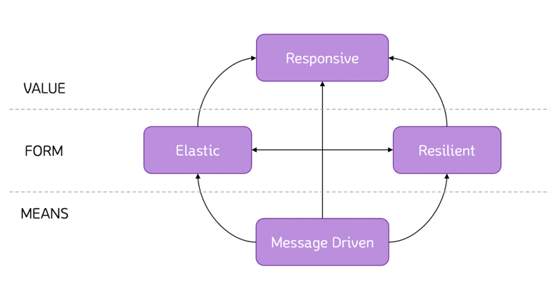
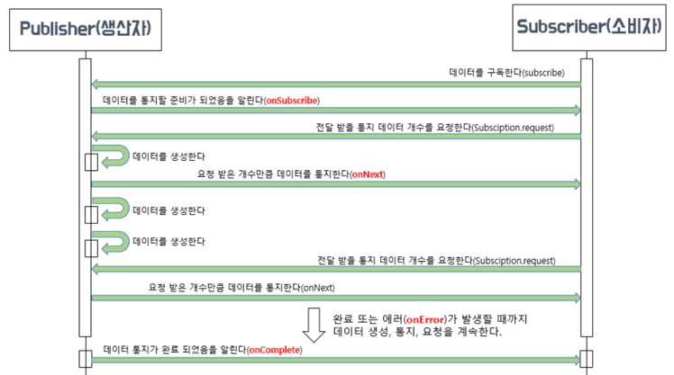
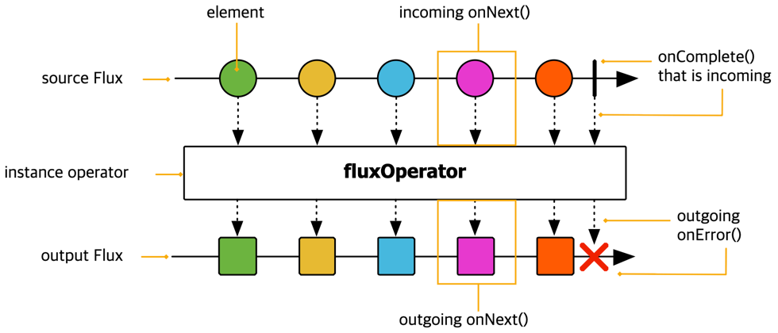
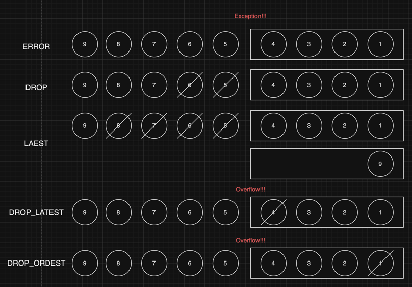

# 스프링으로 시작하는 리액티브 프로그래밍

- URL : https://product.kyobobook.co.kr/detail/S000201399476
- source code : https://github.com/bjpublic/Spring-Reactive

## chapter01. 리액티브 시스템과 리액티브 프로그래밍

### 리액티브 시스템

1. 리액티브 시스템
    - 사전적 의미 : 어떤 이벤트나 상황이 발생했을 때, 반응을 해서 그에 따라 적절하게 행동하는 것
    - 장점 : 클라이언트 요청에 <u>즉각적으로 응답함으로써 지연 시간을 최소화</u>한다.

### 리액티브 선언문 (설계 원칙)



> 빠른 응답성을 바탕으로 유지보수와 확장이 용이한 시스템 구축에 도움이 된다.

- MEANS : reactive system 주요 통신 수단으로 무엇을 사용할 것인지 표현
    - 비동기 메시지 기반의 통신을 통해 느슨한 결합, 격리성, 위치 투명성 보장
- FORM : 비동기 메시지 통신을 통해 어떠한 형태를 지니는 시스템으로 형성되는지에 관한 내용
    - 탄력성(elastic) : 시스템 작업량이 변화하더라도 일정한 응답을 유지한다.
    - 회복성(resilient) : 시스템 장애 발생 시 응답성을 유지하는 것을 의미
- VALUE : 회복성과 탄력성을 기반으로 즉각적 응답 가능한 시스템 구축이 가능하다.

### 리액티브 프로그래밍

- Non-blocking 방식의 통신
    - Blocking : 해당 스레드의 작업이 처리될 때까지 남아있는 작업들이 대기하는 방식 (스레드 차단)
    - Non-blocking : 해당 작업 처리를 대기하지 않고 남아있는 작업을 처리하는 방식

### 리액티브 프로그래밍 특징

1. declarative programming
    - 선언적 : 실행할 동작을 구체적으로 명시하지 않고 목표만 선언하는 방식
    - 명령형 : 실행할 동작을 구체적으로 명시하는 방식
2. data stream & the propagation of change
    - data stream : 데이터가 지속적으로 발생한다는 의미
    - the propagation of change : 지속적으로 데이터가 발생할 때마다 변화하는 이벤트를 보고,
      이 이벤트를 발생시키면서 데이터를 계속적으로 전달하는 것

### 리액티브 프로그래밍 코드 구성

1. publisher : 입력으로 들어오는 데이터를 제공하는 역할
2. subscriber : publisher 로부터 전달받은 데이터를 사용하는 역할
3. data source : publisher 의 입력으로 들어오는 데이터를 대표하는 용어 (reactive programming 에서는 data stream)
4. operator : publisher 와 subscriber 중간에서 가공 처리가 이루어지는 영역

<br>

## chapter02. 리액티브 스트림즈

### 리액티브 스트림즈

- 데이터 스트림을 non-blocking 이면서 비동기적인 방식으로 처리하기 위한 리액티브 라이브러리 표준 사양

### 리액티브 스트림즈 구성요소

| 컴포넌트         | 설명                                                                                                                       |
|--------------|--------------------------------------------------------------------------------------------------------------------------|
| Publisher    | 데이터 생성, 발생하는 역할                                                                                                          |
| Subscriber   | 구독한 publisher 로 부터 데이터를 전달받아 처리하는 역할                                                                                     |
| Subscription | Publisher 에 요청할 데이터 개수를 지정하고, 데이터 구독을 취소하는 역할                                                                            |
| Processor    | Publisher & Subscriber 의 기능을 모두 가지고 있다. 즉, Subscriber 로서 다른 Publisher 를 구독할 수 있고, Publisher 로서 다른 Subscriber 가 구독할 수 있다. |



### Publisher

```java
public interface Publisher<T> {
	public void subscribe(Subscriber<? super T> s);
}
```

- subscribe : 전달받은 Subscriber 를 등록하는 역할을 한다.
  (Pubsub 은 메시지 데이터 전송만 하면 되기 떄문에 loose coupled structure 라 볼 수 있다.)

### Subscriber

```java

public interface Subscriber<T> {
	public void onSubscribe(Subscription s);

	public void onNext(T t);

	public void onError(Throwable t);

	public void onComplete();
}
```

- onSubscribe : 구독 시작 시점에 어떤 처리를 하는 역할
- onNext : Publisher 가 데이터 통지를 위한 처리하는 역할
- onError : Publisher 가 데이터 통지를 위한 처리 과정에서 에러가 발생했을 때 해당 에러를 처리하는 역할
- onComplete : Publisher 가 데이터 통지를 완료했음을 알릴 때 호출되는 메서드

### Subscription

```java
public interface Subscription {
	public void request(long n);

	public void cancel();
}
```

- request : Publisher 에게 요청할 데이터 갯수
- cancel : 구독을 취소할 수 있음

### 동작 과정

1. Publisher 내부 에서 Subscriber onSubscribe() 메서드 호출 -> Subscriber 에게 Subscription 을 전달
2. Subscriber onSubscription() 메서드에서 전달받은 Publisher 에게 Subscription 객체를 통해 전달받을 데이터 갯수 요청
3. Publisher 는 Subscriber onNext() 를 통해 Subscriber 에게 전달
4. Publisher 의 발행할 데이터가 없으면 onComplete() 호출 -> Subscriber 에게 데이터 처리 종료를 알림

### Processor

```java
public interface Processor<T, R> extends Subscriber<T>, Publisher<T> {
}
```

- Publisher, Subscriber 를 모두 상속하고 있음
- Publisher & Subscriber 의 기능을 모두 가지고 있음

### 리액티브 스트림즈 관련 용어 정의

- Signal : Publisher & Subscriber 가넹 주고 받는 상호 작용
    - onSubscriber(), onNest(), onCompmlete(), onError(), request(), cancel()
- Demand : Publisher 가 Subscriber 에게 아직 전달하지 않은 요청 데이터
- Emit : 데이터를 내보내는 과정
    - 데이터를 전달하기 위한 onNext Signal -> 데이터를 emit 한다.
- upstream, downstream : 코드 라인 기준 상위, 하위에 존재하는 스트림
- sequence : Publisher 가 emit 하는 데이터의 연속적인 흐름을 정의해 놓은 자체
- Operator : 연산자 (reactive programming 핵심)
- Source : '최초의' 의미 (Original 용어도 사용)

## chapter03. Blocking I/O 와 Non-Blocking I/O

### Blocking I/O

- DB I/O : database 데이터 조회, 추가 작업
- Network I/O : web application 간의 네트워크 작업

- Blocking I/O : 하나의 스레드가 I/O 에 의해서 차단되어 대기하는 것
    - multi-threading
        - 정의 : Blocking I/O 의 문제점을 보완하기 위해 추가 스레드를 할당하여 차단된 시간을 효율적으로 사용하기 위한 방법
        - 문제점
            - context switching 으로 인한 스레드 전환 비용이 발생 (TCB 저장, reload 시간 동안 CPU 가 대기하는 오버 헤드가 발생한다.)
            - 과도한 메모리 사용으로 인한 오버헤드 : servlet 기반 WAS 는 thread per request 형태로 요청이 많아 메모리 사용량이 증가할 수 있다.
            - thread pool 에서 발생하는 응답 지연 : thread pool 의 유휴 스레드가 없을 경우 응답 지연이 발생한다.
- Non-Blocking I/O
    - 정의 : worker thread 의 종료 여부 관계없이 요청한 스레드는 차단되지 않는 방식
    - 장점
        - 하나의 스레드로 많은 수의 요청을 처리할 수 있다. (Blocking I/O 방식보다 더 적은 수의 스레드 사용)
        - I/O bound 인 경우에 성능에 이점이 있다.
    - 단점 : CPU bound 인 경우, 성능에 악영향을 준다.

### spring framework 에서의 Blocking I/O 와 Non-Blocking I/O

- Spring MVC
    - Blocking I/O 를 처리하기 때문에 대용량 처리가 버거울 수 있는 시대가 되었다.
    - 대표적인 Bean : RestTemplate
- Spring Webflux
    - Netty 기반 비동기 Non-Blocking I/O 기반의 서버이다.
    - 적은 수의 스레드로 많은 요청을 처리하여 CPU 와 메모리를 효율적으로 사용할 수 있다.
    - 대표적인 Bean : WebClient

### Non-Blocking I/O 방식의 통신이 적합한 시스템

- 고려사항 : 학습 난이도 + reactive programming 개발 인력 확보가 쉬운가
- 서비스 종료
    - 대량의 트래픽이 발생하는 시스템 : 상대적으로 저비용으로 고수준의 성능을 이끌어 낼 수 있는 선택이 될 수 있다.
    - MSA : 특정 서버의 응답 지연이 발생하면 전체 서비스에 영향을 미칠 수 있기 때문에 비동기를 지향한다.
    - 스트리밍 또는 실시간 시스템 : 끊임없이 들어오는 데이터 스트림의 효율적 처리가 가능

## chapter04. 리액티브 프로그래밍을 위한 사전 지식

1. Functional Interface
2. 람다 표현식
3. 메서드 레퍼런스
4. 함수 디스크립터
    - Functional interface 가 어떤 파라미터를 가지고 어떤 값을 리턴하는지 설명해주는 역할

| Functional Interface | Function Descriptor |
|:--------------------:|:-------------------:|
|      Predicate       |    T -> boolean     |
|       Consumer       |      T -> void      |
|    Function<T,R>     |       T -> R        |
|       Supplier       |      ( ) -> T       |
|  BiPredicate<L, R>   |  (L, R) -> boolean  |
|   BiConsumer<L, R>   |   (T, U) -> void    |
|  BiFunction<T,U,R>   |     (T, U) -> R     |
|       Runnable       |     () -> void      |

## chapter05. Reactor 개요

### Reactor 란?

- Reactor 의 publisher 과 subscriber 은 functional programming API 를 통해 작성됨
- Flux[N] : N 개의 데이터를 emit 한다는 의미
- Mono[0|1] : 0 or 1 개의 데이터만 emit 한다는 의미
- well-suited for MSA : non-blocking 으로 처리량이 높기 때문
- Backpressure-ready network : publisher 에서 전달한 데이터의 과부하를 제어하는 기능

### Hello Reactor 로 보는 Reactor 의 구성요소

```java
import lombok.extern.slf4j.Slf4j;
import reactor.core.publisher.Flux;

@Slf4j
public class Example5_1 {
    public static void main(String[] args) {
        Flux<String> sequence = Flux.just("Hello", "Reactor"); // data source : Publisher 가 최초로 제공하는 가공되지 않은 데이터
        sequence.map(data -> data.toLowerCase()) // map() Operator 메서드 : 데이터를 가공하는 역할
                .subscribe(data -> System.out.println(data));
    }
}
```

## chapter06. 마블다이어그램

### 마블다이어그램(Marble Diagram) 이란?

- 구슬 모양으로 구성된 도표(다이어그램)
- 리액터의 Operator 의 이해와 흐름을 이해하는데 중요한 역할을 한다.



- timeline : 시간 순으로 데이터가 emit (left -> right)
  - onComplete() signal : 데이터 emit 이 정상적으로 데이터 처리가 종료됨을 의미
  - onError() signal : 데이터 emit 과정에서 에러가 발생해 데이터 처리가 종료를 의미
- source : operator 연산 수행 이전 데이터 값
- output : operator 연산 수행 이후 데이터 값

### 마블 다이어그램으로 Reactor 의 Publisher 이해하기

- Mono : 0개 또는 1개의 데이터를 emit 하는 Publisher (RxJava : MayBe)
  1. `just()` operator : 한 개 이상의 데이터는 emit 하기 위한 Operator. onNext signal 전송
     - HTTP request/response 응답에 사용하기 아주 적합한 publisher 타입
  2. `empty()` operator
     - 내부적으로 emit 할 데이터가 없는 것으로 간주하여 onComplete signal 전송
     - 작업이 끝났음을 알리고 이에 따른 후처리를 하고 싶을 때 사용할 수 있음.
  3. `justOrEmpty()`
     - just() + null 허용 (null 전달 시 내부적으로 empty() operator 호출)
  4. `concatWith()`
     - Publisher 를 연결해서 새로운 Publisher 의 데이터 소스를 만들어주는 operator
     - 두 개의 데이터 소스만 연결

- Flux : 여러 건의 데이터를 emit 할 수 있는 Publisher type
  1. `just()` operator :  한 개 이상의 데이터는 emit 하기 위한 Operator. onNext signal 전송
  2. `fromArray()` operator : 배열 데이터를 처리하기 위한 operator
  3. `concat()`
  - Publisher 를 연결해서 새로운 Publisher 의 데이터 소스를 만들어주는 operator
  - 두 개이상의 데이터 소스 연결 가능

<br>

## chapter07.Cold sequence 와 Hot Sequence

### Cold 와 Hot 의 의미

- Hot : 서버나 시스템을 다시 가동할 필요가 없고, 인터넷에 다시 연결할 필요 없이 바로 사용 가능하다는 의미 (e.g. Hot Swap, Hot Deploy)
- Cold : 처음부터 새로 시작해야 하고, 새로 시작하기 때문에 같은 작업이 반복됨. (e.g. Cold wallet)

### Cold sequence

- Subscriber 가 구독할 때마다 데이터 흐름이 처음부터 다시 시작되는 Sequence
- 구독 시점이 달라도 구독을 할 때마다 Publisher 가 데이터를 emit 하는 과정을 처음부터 다시 시작한다.
- 예시. Flux.fromIterable

### Hot sequence

- 구독이 발생한 시점 이전에 Publisher 로부터 emit 된 데이터는 Subscriber 가 전달받지 못하고 구독이 발생한 시점 이후에 emit 된 데이터만 전달 받을 수 있다.
- e.g. Flux<T>.share() : 여러 Subscriber 가 하나의 원본 Flux 를 공유한다는 의미
- e.g. Mono<T>.cache() : Cold Sequence 로 동작하는 Mono 를 Hot Sequence 로 변경해 주고 데이터를 캐시한 뒤, 구독이 발생할 때마다 캐시된 데이터를 전달한다.

<br>

## Backpressure

### Backpressure 란?

- Backpressure 
  - 배관으로 흡수되는 가스나 액체 등의 흐름을 제어하기 위해 역으로 가해지는 압력을 의미
  - Publisher 가 끊임없이 emit 하는 무수히 많은 데이터를 적절하게 제어하여 데이터 처리에 과부하가 걸리지 않도록 제어하는 것
  - Publisher 가 끊임없이 emit 하는 경우 오버플로가 발생해 최악의 경우 시스템이 다운될 수 있다.

### Reactor 에서의 Backpressure 처리 방식

1. 데이터 갯수 제어
   - request() : 적절한 데이터 갯수를 요청하는 방식
     - hookOnSubscribe() : onSubscribe() 를 대신해 구독 시점에 request() 를 호출해 최초 데이터 요청 갯수를 제어하는 역할
     - hookOnNext() : onNext() 대신해 Publisher 가 emit 한 데이터를 전달받아 처리한 후에 publisher 에게 또 다시 데이터를 요청하는 역할
     - doOnRequest() : Subscriber 가 요청한 데이터 갯수를 확인하는 operator
     - publishOn() : 별도의 스레드가 하나 더 실행된다고 생각하기
2. Backpressure 전략 사용
   - 전략 종류
     - IGNORE : Backpressure 미적용
     - ERROR : Downstream 으로 전달할 데이터가 버퍼에 가득 찰 경우, Exception 발생 (IllegalException)T
     - DROP : Downstream 으로 전달할 데이터가 버퍼에 가득 찰 경우, 먼저 emit 된 데이터부터 Drop 시키는 전략
     - LATEST : Downstream 으로 전달할 데이터가 버퍼에 가득 찰 경우, 버퍼 밖에 대기하는 가장 최근에(나중에) emit 된 데이터부터 버퍼를 채우는 전략
     - BUFFER : Downstream 으로 전달할 데이터가 버퍼에 가득 찰 경우, 버퍼 안에 있는 데이터부터 Drop 시키는 전략


